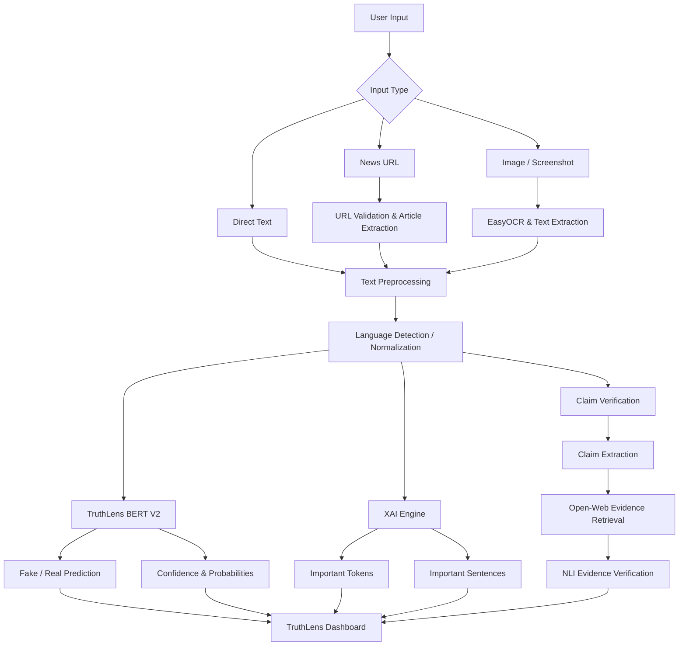
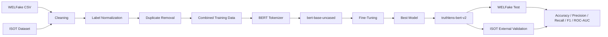

# 🔍 TruthLens AI

## Explainable Fake News Detection & Evidence Verification System

> **TruthLens AI** is an end-to-end, explainable misinformation-analysis platform that combines **BERT-based fake-news classification, Explainable AI (XAI), OCR, multilingual processing, URL/article extraction, claim extraction, open-web evidence retrieval, NLI-based verification, and a web dashboard** into a unified system.

---

## 📌 Project Overview

TruthLens AI is designed to go beyond a simple **Fake / Real** prediction.

Traditional fake-news classifiers can tell a user what the model predicted, but they often do not explain:

- **Why** the model made that prediction
- **Which words or sentences** influenced the prediction
- **Which claims** should be verified
- **What external evidence** supports or contradicts those claims
- **How the source content** was extracted
- **How multilingual or image-based news** can be processed

The rapid growth of online information has made it increasingly difficult to distinguish reliable news from misleading or fabricated content.

Traditional fake-news detection systems often provide only a binary prediction such as:

> FAKE ❌

or

> REAL ✅

without explaining why the prediction was made.

TruthLens AI addresses these limitations by combining a production BERT model server with explainability, OCR, multilingual processing, article extraction, claim verification, and evidence retrieval.

The project is developed as a **Bachelor of Technology (B.Tech) Computer Science & Engineering final-year project** at **Integral University, Lucknow**.

---

## 🎓 Academic Information

| Field | Details |
|---|---|
| **Project Title** | TruthLens AI: Explainable Fake News Detection System |
| **Degree** | Bachelor of Technology |
| **Branch** | Computer Science & Engineering |
| **Institution** | Integral University, Lucknow |
| **Academic Year** | 2026–2027 |
| **Supervisor** | Dr. Saleha Mariyam |

### 👥 Project Team

| Name | Role / Area |
|---|---|
| **Intakhab Nabi** | AI/ML / Backend / System Integration | Development / Integration |
| **Syed Ayan Ahmad** | XAI / Testing / NLP / ML |
| **Faraz Nasim Kidwai** | Research Lead / Documentation |
| **Fareed Khan** | Research Associate / Literature Reviewer  |

---

## 🎯 Why TruthLens AI?

The rapid growth of digital media and social networking platforms has made information easier to create and distribute, but it has also made the spread of misleading and fabricated information significantly easier.

A conventional classifier may return:

```text
Prediction: FAKE
Confidence: 91%
```

TruthLens AI attempts to provide a much richer analysis:

```text
Prediction
    ↓
Confidence
    ↓
Influential tokens
    ↓
Important sentences
    ↓
Claim extraction
    ↓
External evidence retrieval
    ↓
NLI-based verification
    ↓
Overall verification assessment
```

The system deliberately keeps **model prediction** separate from **retrieved evidence**, so an AI explanation is not presented as factual evidence by itself.

---

# ✨ Key Features

## 🤖 1. BERT-Based Fake News Detection

TruthLens AI uses a fine-tuned:

- **Base model:** `bert-base-uncased`
- **Production model:** `truthlens-bert-v2`
- **Task:** Binary sequence classification
- **Labels:**
  - `0 = FAKE`
  - `1 = REAL`

The V2 training pipeline combines **WELFake** and **ISOT** data and saves the resulting model under:

```text
models/truthlens-bert-v2
```

---

## 🧠 2. Long-Article Sliding-Window Inference

BERT has a maximum token context length.

Instead of simply truncating long articles, TruthLens AI uses **sliding-window inference**.

### Inference configuration

| Parameter | Value |
|---|---:|
| Maximum sequence length | `256` tokens |
| Sliding stride | `64` tokens |
| Inference batch size | `4` |
| Queue size | `32` requests |
| Batch wait | `15 ms` |
| GPU FP16 | Enabled when CUDA is available |

Long text is divided into overlapping windows, each window is evaluated, and the resulting probabilities are combined using token-count weighting.

This allows long news articles to be analyzed without simply discarding everything after the first 256 tokens.

---

## ⚡ 3. Production Model Serving

The project contains a dedicated model-serving layer with:

- CUDA support
- FP16 inference when a compatible GPU is available
- Micro-batching
- Inference queue
- Sliding-window processing
- Request timeout handling
- Model health monitoring
- CPU fallback

The production model server automatically chooses:

```text
CUDA GPU → if available
CPU      → otherwise
```

---

## 🔎 4. Explainable AI (XAI)

TruthLens AI does not stop at classification.

The XAI module uses **BERT transformer attention analysis** to identify:

- Important tokens
- Important words
- Important sentences
- Relative token importance

### XAI pipeline

```text
Input Article
     ↓
Text Cleaning
     ↓
Sliding Windows
     ↓
BERT Attention
     ↓
Last Transformer Layer
     ↓
Average Attention Across Heads
     ↓
Token Importance
     ↓
Sentence Importance
     ↓
Human-Readable Explanation
```

The current implementation uses the model's attention outputs and reuses token-importance calculations for sentence-level analysis instead of unnecessarily running a separate model pass for every sentence.

---

## 🖼️ 5. OCR-Based Image Analysis

TruthLens AI can analyze screenshots and images containing news or textual content.

Supported image formats:

- JPG
- JPEG
- PNG
- WEBP

### OCR pipeline

```text
Image Upload
     ↓
EasyOCR
     ↓
Script Detection
     ↓
Text Extraction
     ↓
Language Detection
     ↓
Language Normalization / Translation
     ↓
BERT Classification
     ↓
XAI Explanation
     ↓
Verification Available Separately
```

The current API limits image uploads to **8 MB by default**.

---

## 🌐 6. URL-Based News Analysis

Users can submit a publicly accessible news/article URL.

TruthLens AI:

1. Validates the URL
2. Retrieves the webpage
3. Extracts article content
4. Cleans the extracted text
5. Runs BERT classification
6. Generates XAI explanations
7. Starts background evidence verification

### URL pipeline

```text
News URL
   ↓
URL Validation
   ↓
Webpage Retrieval
   ↓
Article Extraction
   ↓
Text Cleaning
   ↓
BERT Model
   ↓
XAI
   ↓
Background Claim Extraction
   ↓
Evidence Retrieval
   ↓
NLI Verification
```

The backend also blocks URLs that resolve to private, loopback, link-local, multicast, reserved, or unspecified network addresses.

---

## 🌍 7. Multilingual Processing

TruthLens AI supports multilingual input through a language-processing pipeline.

The system can:

1. Detect the input language
2. Normalize the content
3. Translate to English when required
4. Analyze the normalized English text
5. Return the original and translated text
6. Preserve the language information in the response

### Multilingual pipeline

```text
Original Text
     ↓
Language Detection
     ↓
Translation / Normalization
     ↓
English Analysis Text
     ↓
TruthLens BERT V2
     ↓
XAI
     ↓
Claim & Evidence Verification
```

This architecture allows the English-trained classifier to be used with supported non-English inputs through preprocessing and translation.

---

# 🧾 8. Claim Extraction

TruthLens AI treats an article as more than a single classification unit.

The verification pipeline identifies factual claims that require checking.

The current verification workflow checks up to **3 claims** per verification request.

```text
Article
   ↓
Claim Extraction
   ↓
Claim Selection
   ↓
Evidence Search
   ↓
Evidence Comparison
   ↓
NLI Verification
```

---

# 🔬 9. Evidence Retrieval & Verification

TruthLens AI separates:

> **Model prediction ≠ factual evidence**

The verification system retrieves external information and evaluates extracted claims against the available evidence.

The verification pipeline is:

```text
Text
 ↓
Claim Extraction
 ↓
Open-Web Evidence Retrieval
 ↓
Evidence Collection
 ↓
NLI Evidence Verification
 ↓
Claim-Level Results
 ↓
Overall Assessment
```

For URL analysis, verification runs in the background so that the main classification result does not have to wait for evidence retrieval.

---

# 💾 10. Persistent Verification Jobs

Verification jobs are stored in a local **SQLite database**.

The backend maintains information such as:

- Verification ID
- URL
- Article title
- Article text
- Verification status
- Result JSON
- Creation time
- Last update time

Jobs can be resumed after a server restart.

By default, old verification jobs are retained for **24 hours**.

---

# 📊 11. Analysis Dashboard

The web application provides a dashboard-oriented interface for presenting analysis results.

The overall system is designed to expose:

- Prediction
- Confidence
- Fake probability
- Real probability
- Important tokens
- Important sentences
- Claim-level verification
- Retrieved evidence
- Language information
- OCR results
- URL/article information
- Verification status
- Analysis history

---

# 🏗️ System Architecture



---

# 🔄 End-to-End Workflow

## Text Analysis

```text
Text Input
   ↓
Validation
   ↓
TruthLens BERT V2
   ↓
Prediction + Probability + Confidence
   ↓
XAI Attention Analysis
   ↓
Important Tokens / Sentences
   ↓
Dashboard
```

## URL Analysis

```text
URL
   ↓
Security Validation
   ↓
Article Extraction
   ↓
Text Analysis
   ↓
BERT Prediction
   ↓
XAI
   ↓
Verification Job Created
   ↓
Background Claim Extraction
   ↓
Evidence Retrieval
   ↓
NLI Verification
   ↓
Verification Status API
```

## Image Analysis

```text
Image
   ↓
EasyOCR
   ↓
Extracted Text
   ↓
Language Detection
   ↓
Translation / Normalization
   ↓
BERT
   ↓
XAI
   ↓
Result Dashboard
```

---

# 📚 Datasets

TruthLens AI V2 uses **two major fake-news datasets**:

1. **ISOT Fake News Dataset**
2. **WELFake Dataset**

The project combines these datasets to improve training diversity and evaluates generalization using a separate ISOT validation set.

---

## 1. ISOT Fake News Dataset

The ISOT dataset contains approximately **44,898 news articles**:

| Class | Articles |
|---|---:|
| Real | 21,417 |
| Fake | 23,481 |
| **Total** | **44,898** |

The dataset contains real and fake news articles, with a large portion focused on political and world news.

### Original structure

The traditional ISOT dataset contains:

```text
True.csv
Fake.csv
```

Typical fields include:

- Article title
- Article text
- Subject
- Publication date

### TruthLens label conversion

The source dataset uses a different target convention from TruthLens.

```text
ISOT:
0 = TRUE
1 = FALSE
```

TruthLens converts this to:

```text
TruthLens:
0 = FAKE
1 = REAL
```

The transformation is:

```python
truthlens_label = 1 - isot_target
```

### Dataset source

- [ISOT Fake News Dataset](https://onlineacademiccommunity.uvic.ca/isot/2022/11/27/fake-news-detection-datasets/)
- [ISOT Dataset Reference](https://www.kaggle.com/datasets/rahulogoel/isot-fake-news-dataset)

---

## 2. WELFake Dataset

WELFake stands for:

> **Word Embedding over Linguistic Features for Fake News Detection**

The dataset contains **72,134 accessible news articles**:

| Class | Articles |
|---|---:|
| Real | 35,028 |
| Fake | 37,106 |
| **Total** | **72,134** |

The dataset contains:

```text
id / serial number
title
text
label
```

with:

```text
0 = FAKE
1 = REAL
```

WELFake was constructed by combining multiple existing news datasets, including sources associated with Kaggle, McIntire, Reuters, and BuzzFeed Political.

### Dataset source

- [WELFake on Zenodo](https://zenodo.org/records/4561253)
- [WELFake on Hugging Face](https://huggingface.co/datasets/davanstrien/WELFake)
- [WELFake on Kaggle](https://www.kaggle.com/datasets/saurabhshahane/fake-news-classification)

---

# 🧪 Dataset Preparation

The V2 training pipeline performs several preprocessing operations.

### WELFake preprocessing

```text
Load CSV
   ↓
Validate required columns
   ↓
Fill missing title/text
   ↓
Normalize whitespace
   ↓
Convert labels to integers
   ↓
Combine title + article text
   ↓
Remove very short samples
   ↓
Remove duplicates
   ↓
Stratified train/validation/test split
```

### ISOT preprocessing

```text
Load cleaned ISOT dataset
   ↓
Normalize text
   ↓
Validate labels
   ↓
Convert ISOT labels to TruthLens labels
   ↓
Remove very short samples
   ↓
Remove duplicates
   ↓
Keep validation data external to training
```

### Cross-dataset duplicate removal

The training pipeline also removes duplicate text shared between WELFake training data and ISOT training data.

This helps reduce direct data leakage between the two sources.

---

# 🧠 Model Training

## Base Model

```text
bert-base-uncased
```

## Fine-Tuned Model

```text
truthlens-bert-v2
```

## Training Configuration

| Parameter | Value |
|---|---:|
| Base model | `bert-base-uncased` |
| Maximum tokens | `256` |
| Epochs | `3` |
| Learning rate | `2e-5` |
| Weight decay | `0.01` |
| Training batch size | `8` |
| Evaluation batch size | `8` |
| Gradient accumulation | `2` |
| Effective batch size | `16` |
| Scheduler | Cosine |
| Warmup | ~5% of training steps |
| Seed | `42` |
| Early stopping patience | `2` |
| Best-model metric | F1 |
| FP16 | Enabled when CUDA is available |

---

# 📈 Evaluation Metrics

TruthLens AI evaluates the model using:

| Metric | Purpose |
|---|---|
| **Accuracy** | Overall classification correctness |
| **Precision** | Correctness of positive predictions |
| **Recall** | Ability to detect positive samples |
| **F1-Score** | Balance between precision and recall |
| **ROC-AUC** | Ranking/discrimination capability |
| **Confusion Matrix** | Detailed classification errors |

The training pipeline evaluates:

```text
WELFake Test Set
+
External ISOT Validation Set
```

This is important because the ISOT validation data is kept separate from the training process.

> **Note:** Final numerical evaluation results should be reported from the generated training/evaluation metadata rather than hard-coded into this README.

---

# 🧰 Technology Stack

## Frontend

| Technology | Purpose |
|---|---|
| **React** | User interface |
| **TypeScript** | Type-safe frontend development |
| **Vite** | Development server and build tool |
| **Tailwind CSS** | UI styling |
| **React DOM** | Browser rendering |

The current frontend package uses React 19, TypeScript, Vite and Tailwind CSS.

---

## Backend

| Technology | Purpose |
|---|---|
| **Python** | Backend and AI services |
| **FastAPI** | REST API |
| **Uvicorn** | ASGI server |
| **Pydantic** | Request validation |
| **SQLite** | Verification job persistence |
| **ThreadPoolExecutor** | Background verification jobs |

---

## AI / ML

| Technology | Purpose |
|---|---|
| **PyTorch** | Deep learning |
| **Hugging Face Transformers** | BERT model and tokenizer |
| **BERT** | Fake-news classification |
| **Datasets** | Dataset loading and processing |
| **scikit-learn** | Splitting and evaluation metrics |
| **NumPy** | Numerical operations |
| **Pandas** | Dataset processing |

---

## Explainable AI

The project uses:

- BERT attention analysis
- Token importance
- Sentence importance
- Transformer attention visualization concepts

The current implementation performs attention-based explanations using the production BERT V2 model.

---

## OCR

- **EasyOCR**
- Script detection
- Multilingual text extraction
- Image preprocessing / temporary file handling

---

## Retrieval & Verification

- Open-web evidence retrieval
- Claim extraction
- NLI-based evidence verification
- Background verification jobs
- SQLite persistence

---

## Development & Deployment

- Git
- GitHub
- Docker
- Docker Compose
- VS Code
- Postman / REST testing
- CUDA
- NVIDIA GPU support

---

# 📁 Repository Structure

```text
TruthLens-AI/
│
├── backend/
│   └── main.py
│       ├── FastAPI application
│       ├── API routes
│       ├── URL analysis
│       ├── image/OCR analysis
│       ├── multilingual analysis
│       ├── verification jobs
│       ├── SQLite persistence
│       └── health/readiness endpoints
│
├── frontend/
│   ├── src/
│   ├── public/
│   ├── package.json
│   ├── vite.config.*
│   └── Dockerfile
│
├── models/
│   └── truthlens-bert-v2/
│       ├── model weights
│       ├── tokenizer
│       └── model configuration
│
├── src/
│   ├── model_server.py
│   ├── explain.py
│   ├── ocr.py
│   ├── url_extractor.py
│   ├── verifier.py
│   └── multilingual.py
│
├── train_v2.py
│
├── Dockerfile.backend
├── docker-compose.yml
├── .dockerignore
├── .env.example
├── .gitignore
├── .gitattributes
├── package.json
├── package-lock.json
│
└── README.md
```

---

# 🚀 Installation

## 1. Prerequisites

### Required

- **Python 3.10+**
- **Node.js 18+**
- **npm**
- **Git**

### Recommended for AI inference

- NVIDIA GPU
- CUDA-compatible PyTorch installation
- At least 8 GB system RAM
- Sufficient disk space for model files and datasets

### Optional

- Docker
- Docker Compose

---

# 📥 Clone the Repository

```bash
git clone https://github.com/Raaaaahil/TruthLens-AI.git
```

Move into the project:

```bash
cd TruthLens-AI
```

---

# 🐍 Backend Setup

## Windows

Create a virtual environment:

```powershell
python -m venv .venv
```

Activate it:

```powershell
.venv\Scripts\Activate.ps1
```

If PowerShell blocks activation:

```powershell
Set-ExecutionPolicy -ExecutionPolicy RemoteSigned -Scope CurrentUser
```

Then activate again:

```powershell
.venv\Scripts\Activate.ps1
```

---

## Linux / macOS

```bash
python3 -m venv .venv
source .venv/bin/activate
```

---

## Install Backend Dependencies

From the repository root:

```bash
pip install -r backend/requirements.txt
```

If your local branch stores the dependency file under a different path, install from that backend dependency file before starting the API.

---

# ⚙️ Environment Configuration

Copy the example environment file:

### Windows

```powershell
copy .env.example .env
```

### Linux / macOS

```bash
cp .env.example .env
```

The default configuration contains:

```env
TRUTHLENS_VERSION=1.1.0
TRUTHLENS_HOST=0.0.0.0
TRUTHLENS_PORT=8000

TRUTHLENS_DB=/app/data/truthlens_jobs.db

TRUTHLENS_MAX_TEXT_CHARS=20000
TRUTHLENS_MAX_URL_LENGTH=2048
TRUTHLENS_MAX_IMAGE_BYTES=8388608

TRUTHLENS_JOB_RETENTION_HOURS=24
TRUTHLENS_VERIFY_WORKERS=2

TRUTHLENS_LOG_LEVEL=INFO

TRUTHLENS_CORS_ORIGINS=http://localhost:5173,http://127.0.0.1:5173
```

### Model-serving configuration

The model server also supports:

```env
TRUTHLENS_MODEL_PATH=models/truthlens-bert-v2
TRUTHLENS_MODEL_MAX_LENGTH=256
TRUTHLENS_MODEL_STRIDE=64
TRUTHLENS_MODEL_BATCH_SIZE=4
TRUTHLENS_MODEL_QUEUE_SIZE=32
TRUTHLENS_MODEL_BATCH_WAIT_MS=15
TRUTHLENS_MODEL_FP16=1
```

---

# 🤖 Model Files

The production backend expects the trained model at:

```text
models/truthlens-bert-v2/
```

The model server loads the tokenizer and model **locally**.

It does not depend on downloading the model from Hugging Face during every inference request.

If the model directory is missing, the backend will report:

```text
TruthLens model not found
```

Make sure the model directory exists before starting the backend.

---

# ▶️ Start the Backend

From the repository root:

```bash
uvicorn backend.main:app --host 0.0.0.0 --port 8000
```

The API will be available at:

```text
http://localhost:8000
```

---

# 📖 FastAPI Documentation

Once the backend is running, open:

```text
http://localhost:8000/docs
```

FastAPI automatically provides interactive Swagger documentation.

Alternative:

```text
http://localhost:8000/redoc
```

---

# 🩺 Backend Health Checks

## Root

```http
GET /
```

Example:

```bash
curl http://localhost:8000/
```

---

## Health

```http
GET /health
```

```bash
curl http://localhost:8000/health
```

---

## Readiness

```http
GET /ready
```

This checks both:

- Database availability
- Model-serving readiness

---

## Model Health

```http
GET /model-health
```

This exposes model-serving information such as:

- Model name
- Device
- FP16 status
- Batch size
- Queue size

---

# 🎨 Frontend Setup

Open a second terminal.

Navigate to the frontend:

```bash
cd frontend
```

Install dependencies:

```bash
npm install
```

Start the development server:

```bash
npm run dev
```

The frontend normally becomes available at:

```text
http://localhost:5173
```

---

# 🏗️ Frontend Production Build

```bash
npm run build
```

Preview the production build:

```bash
npm run preview
```

Lint the frontend:

```bash
npm run lint
```

---

# 🐳 Docker Deployment

TruthLens AI includes Docker support for running the backend and frontend together.

## 1. Build the Backend Image

Because the current Compose configuration references the backend image directly, build it first:

```bash
docker build -f Dockerfile.backend -t truthlens-backend:1.0 .
```

---

## 2. Start the Full System

```bash
docker compose up --build
```

Or:

```bash
docker-compose up --build
```

---

## 3. Run in Background

```bash
docker compose up -d --build
```

---

## 4. Stop the System

```bash
docker compose down
```

---

## Docker Services

| Service | Container | Port |
|---|---|---:|
| Backend | `truthlens-backend` | `8000` |
| Frontend | `truthlens-frontend` | `5173` |

The Compose configuration also creates persistent Docker volumes for:

```text
truthlens-data
truthlens-models
```

The backend is configured for GPU access through Docker when the host supports it.

---

# 🔌 API Reference

## `GET /`

Returns basic API and model information.

```http
GET /
```

---

## `GET /health`

Returns service health.

```http
GET /health
```

---

## `GET /ready`

Checks:

- SQLite database
- Model serving

```http
GET /ready
```

---

## `GET /model-health`

Returns model-serving status.

```http
GET /model-health
```

---

## `POST /predict`

Performs standard text classification.

### Request

```json
{
  "text": "Example news article text goes here."
}
```

### Example

```bash
curl -X POST http://localhost:8000/predict \
  -H "Content-Type: application/json" \
  -d "{\"text\":\"Example news article text goes here.\"}"
```

---

## `POST /explain`

Runs classification together with XAI explanation.

### Request

```json
{
  "text": "Example news article text goes here."
}
```

### Output contains

- Model analysis
- Prediction
- Probabilities
- Confidence
- Important tokens
- Important sentences
- Explanation metadata

---

## `POST /verify`

Runs claim and evidence verification.

```json
{
  "text": "Example article containing factual claims."
}
```

Verification pipeline:

```text
Text
 ↓
Claim Extraction
 ↓
Open-Web Evidence Retrieval
 ↓
NLI Evidence Verification
```

---

## `POST /analyze-multilingual`

Runs multilingual analysis.

```json
{
  "text": "Multilingual news content goes here."
}
```

The response includes:

- Detected language
- Original text
- Translated text
- Translation status
- Model analysis
- XAI explanation
- Verification information

---

## `POST /analyze-image`

Analyzes an uploaded screenshot/image.

### Supported formats

```text
JPG
JPEG
PNG
WEBP
```

### Example

```bash
curl -X POST http://localhost:8000/analyze-image \
  -F "file=@news_screenshot.png"
```

The response can include:

- OCR text
- OCR segments
- Segment count
- Detected language
- Translation information
- BERT analysis
- XAI explanation
- Verification information

---

## `POST /analyze-url`

Analyzes a public news/article URL.

### Request

```json
{
  "url": "https://example.com/news/article"
}
```

### Example

```bash
curl -X POST http://localhost:8000/analyze-url \
  -H "Content-Type: application/json" \
  -d "{\"url\":\"https://example.com/news/article\"}"
```

The endpoint returns:

- Extracted article title
- Article text
- Word count
- Character count
- BERT analysis
- XAI explanation
- Verification ID
- Initial verification status

---

## `GET /verification-status/{verification_id}`

Checks the status of a background verification job.

```http
GET /verification-status/{verification_id}
```

Example:

```bash
curl http://localhost:8000/verification-status/YOUR_VERIFICATION_ID
```

---

## `POST /verification-status`

Checks the latest verification result associated with a URL.

### Request

```json
{
  "url": "https://example.com/news/article"
}
```

---

# 🧪 Model Training

The complete V2 training pipeline is implemented in:

```text
train_v2.py
```

---

## Training Data Layout

WELFake is expected locally at:

```text
data/WELFake_Dataset.csv
```

The training script loads ISOT through the configured Hugging Face dataset:

```text
Phoenyx83/ISOT-Fake-News-Dataset-FineTuned-2022
```

---

## Train TruthLens BERT V2

From the project root:

```bash
python train_v2.py
```

The training script:

1. Loads WELFake
2. Cleans WELFake
3. Splits WELFake into train/validation/test
4. Loads ISOT
5. Converts ISOT labels
6. Cleans ISOT
7. Removes duplicates
8. Removes cross-dataset duplicates
9. Combines training data
10. Tokenizes using BERT
11. Fine-tunes `bert-base-uncased`
12. Evaluates WELFake
13. Evaluates external ISOT data
14. Saves the model
15. Saves training metadata

---

# 📦 Training Output

The trained model is saved to:

```text
models/truthlens-bert-v2/
```

Training metadata is written to:

```text
models/truthlens-bert-v2/training_metadata.txt
```

---

# 🔬 Training Architecture



---

# 🔐 Security & Reliability

TruthLens AI includes several backend protections.

## URL Security

The URL validator:

- Requires HTTP/HTTPS
- Rejects malformed URLs
- Rejects embedded credentials
- Rejects localhost
- Rejects private IP addresses
- Rejects loopback addresses
- Rejects link-local addresses
- Rejects multicast addresses
- Rejects reserved addresses
- Rejects unspecified addresses

This reduces the risk of unsafe server-side URL fetching.

---

## Request Validation

Pydantic request models enforce:

- Required fields
- Text length limits
- URL length limits
- Strict request structures
- Invalid request handling

---

## Image Upload Protection

The backend:

- Restricts supported MIME types
- Limits upload size
- Writes the image to a temporary file
- Deletes the temporary file after processing

---

## Response Security Headers

The backend sets security-related headers including:

```text
X-Content-Type-Options: nosniff
X-Frame-Options: DENY
Referrer-Policy: strict-origin-when-cross-origin
```

---

# ⚙️ Default System Limits

| Setting | Default |
|---|---:|
| Maximum text length | `20,000` characters |
| Maximum URL length | `2,048` characters |
| Maximum image size | `8 MB` |
| Verification retention | `24 hours` |
| Verification workers | `2` |
| Model max tokens | `256` |
| Model stride | `64` |
| Model batch size | `4` |
| Model queue size | `32` |
| Batch wait | `15 ms` |

These values can be changed using environment variables.

---

# 🧪 Testing Strategy

TruthLens AI follows multiple levels of testing.

## Unit Testing

Individual modules can be tested independently:

- Text preprocessing
- Tokenization
- Model inference
- XAI generation
- OCR
- URL extraction
- Claim extraction
- Evidence retrieval
- Database operations
- API endpoints

---

## Integration Testing

Integration testing covers:

```text
Frontend
   ↕
Backend
   ↕
Model Server
   ↕
XAI
   ↕
Claim Verification
   ↕
Evidence Retrieval
   ↕
Database
```

---

## End-to-End Testing

Typical end-to-end flows include:

### Text

```text
Text → Prediction → XAI → Dashboard
```

### URL

```text
URL → Extraction → Prediction → XAI → Verification → Dashboard
```

### Image

```text
Image → OCR → Language Processing → Prediction → XAI → Dashboard
```

### Multilingual

```text
Input → Language Detection → Translation → BERT → XAI → Results
```

---

# 📊 Expected Output

A typical text-analysis response conceptually contains:

```json
{
  "source": "text",
  "analysis": {
    "prediction": "FAKE",
    "fake_probability": 0.91,
    "real_probability": 0.09,
    "confidence": 0.91,
    "model": "truthlens-bert-v2"
  },
  "explanation": {
    "important_tokens": [],
    "important_sentences": []
  }
}
```

> The exact response structure may evolve as the backend modules are updated. Use `/docs` for the current live API schema.

---

# 🧩 Main Software Components

| Component | Responsibility |
|---|---|
| `backend/main.py` | FastAPI application and API routes |
| `src/model_server.py` | Production BERT inference |
| `src/explain.py` | XAI / attention analysis |
| `src/ocr.py` | Image text extraction |
| `src/url_extractor.py` | News article extraction |
| `src/multilingual.py` | Language detection and normalization |
| `src/verifier.py` | Claims, evidence and NLI verification |
| `train_v2.py` | Multi-dataset BERT V2 training |
| `models/truthlens-bert-v2/` | Production trained model |
| `frontend/` | React + TypeScript dashboard |
| `docker-compose.yml` | Multi-container deployment |
| `Dockerfile.backend` | Backend container image |

---

# 🎯 Project Objectives

## Primary Objectives

- Develop an NLP-based fake-news detection system.
- Build an Explainable AI web platform.
- Provide transparent and interpretable predictions.
- Combine model predictions with evidence-based verification.

## Secondary Objectives

- Fine-tune BERT for fake-news classification.
- Integrate OCR-based analysis.
- Support multilingual processing.
- Provide claim-level verification.
- Retrieve supporting or contradicting evidence.
- Evaluate system performance and reliability.
- Provide a complete web-based interface.

---

# 📌 Project Scope

TruthLens AI focuses on:

- News article analysis
- Direct text analysis
- URL-based analysis
- Screenshot/image OCR
- Transformer-based classification
- Explainable AI
- Claim extraction
- Evidence retrieval
- NLI verification
- Multilingual processing
- Analysis history
- Web dashboard

---

# 🚫 Current Limitations

TruthLens AI is an AI-assisted misinformation-analysis system and **not a replacement for professional fact-checking**.

The system does not guarantee:

- Perfect factual verification
- Detection of every form of misinformation
- Detection of every AI-generated article
- Detection of every deepfake
- Identification of the original creator of misinformation
- Legal or journalistic certification
- Perfect performance on topics outside the training distribution

Model predictions are based on patterns learned from training data.

Retrieved evidence should be reviewed by the user before treating a claim as conclusively verified.

---

# 🔮 Future Enhancements

Potential future improvements include:

- Larger and more diverse multilingual datasets
- Improved multilingual transformer models
- Advanced claim decomposition
- Better evidence ranking
- More fact-checking sources
- Knowledge-base / RAG integration
- Browser extension
- Social-media integration
- Image AI-generation detection
- Video misinformation analysis
- Deepfake detection
- Misinformation trend analysis
- Historical misinformation similarity search
- Advanced source credibility analysis
- Better calibration and uncertainty estimation
- Larger-scale deployment
- Automated report generation
- More extensive adversarial robustness testing

---

# 📚 Research Background

The project is based on research areas including:

- Natural Language Processing
- Transformer architectures
- BERT
- Fake-news detection
- Explainable AI
- Information retrieval
- Claim verification
- Natural Language Inference
- OCR
- Multilingual NLP
- Responsible AI

---

# 📖 References

1. Devlin, J., Chang, M. W., Lee, K., & Toutanova, K. (2019). **BERT: Pre-training of Deep Bidirectional Transformers for Language Understanding.** NAACL-HLT.

2. Vaswani, A., Shazeer, N., Parmar, N., et al. (2017). **Attention Is All You Need.** NeurIPS.

3. Shu, K., Sliva, A., Wang, S., Tang, J., & Liu, H. (2017). **Fake News Detection on Social Media: A Data Mining Perspective.** ACM SIGKDD Explorations Newsletter.

4. Shu, K., Wang, S., & Liu, H. (2019). **Beyond News Contents: The Role of Social Context for Fake News Detection.** WSDM.

5. Ribeiro, M. T., Singh, S., & Guestrin, C. (2016). **"Why Should I Trust You?": Explaining the Predictions of Any Classifier.** KDD.

6. Lundberg, S. M., & Lee, S. I. (2017). **A Unified Approach to Interpreting Model Predictions.** NeurIPS.

7. Thorne, J., Vlachos, A., Christodoulopoulos, C., & Mittal, A. (2018). **FEVER: A Large-scale Dataset for Fact Extraction and VERification.** NAACL-HLT.

8. Zellers, R., Holtzman, A., Rashkin, H., et al. (2019). **Defending Against Neural Fake News.** NeurIPS.

9. Bender, E. M., Gebru, T., McMillan-Major, A., & Shmitchell, S. (2021). **On the Dangers of Stochastic Parrots: Can Language Models Be Too Big?** FAccT.

10. Zhou, X., & Zafarani, R. (2020). **A Survey of Fake News: Fundamental Theories, Detection Methods, and Opportunities.** ACM Computing Surveys.

11. Verma, P. K., Agrawal, P., Amorim, I., & Prodan, R. **WELFake: Word Embedding Over Linguistic Features for Fake News Detection.** IEEE Transactions on Computational Social Systems.

12. Ahmed, H., Traore, I., & Saad, S. **Detecting Opinion Spams and Fake News Using Text Classification.** Journal of Security and Privacy.

---

# 📦 Dataset References

### ISOT

- [University of Victoria — ISOT Fake News Dataset](https://onlineacademiccommunity.uvic.ca/isot/2022/11/27/fake-news-detection-datasets/)
- [Kaggle — ISOT Fake News Dataset](https://www.kaggle.com/datasets/rahulogoel/isot-fake-news-dataset)

### WELFake

- [Zenodo — WELFake Dataset](https://zenodo.org/records/4561253)
- [Hugging Face — WELFake](https://huggingface.co/datasets/davanstrien/WELFake)
- [Kaggle — WELFake](https://www.kaggle.com/datasets/saurabhshahane/fake-news-classification)

---

# 🛠️ Development Workflow

```text
Requirement Analysis
        ↓
Dataset Collection
        ↓
Data Cleaning
        ↓
Baseline / Initial Model
        ↓
BERT V2 Development
        ↓
Model Evaluation
        ↓
Production Model Serving
        ↓
XAI Integration
        ↓
OCR Integration
        ↓
Multilingual Integration
        ↓
URL Extraction
        ↓
Claim & Evidence Verification
        ↓
Frontend Integration
        ↓
Docker Integration
        ↓
Testing
        ↓
Final Evaluation
```

---

# 👨‍💻 Development Guidelines

When extending the project:

- Keep model prediction separate from evidence verification.
- Do not treat XAI explanations as factual evidence.
- Validate all external URLs.
- Avoid committing API keys or secrets.
- Keep datasets outside Git when they are too large.
- Keep trained model artifacts versioned or externally hosted when appropriate.
- Preserve reproducibility using fixed random seeds.
- Document changes to the model and training pipeline.
- Test both CPU and GPU execution paths where applicable.

---

# 🔒 Environment & Secret Management

Never commit private credentials.

Use:

```text
.env
```

for local configuration.

The repository provides:

```text
.env.example
```

as a configuration template.

Before pushing to GitHub, verify that:

```text
.env
```

is ignored by Git.

---

# 🧹 Recommended Git Checks

Before committing:

```bash
git status
```

Check ignored files:

```bash
git status --ignored
```

Review staged files:

```bash
git diff --cached
```

Then commit:

```bash
git add .
git commit -m "Update TruthLens AI documentation"
```

Push:

```bash
git push origin main
```

---

# 📜 License

A license file should be added to the repository before distributing TruthLens AI as an open-source project.

If the project is intended to remain an academic/private repository, keep the repository access and usage terms aligned with the team's university/project requirements.

---

# 🎓 Academic Disclaimer

TruthLens AI is an academic and research-oriented project developed to demonstrate the integration of:

- Artificial Intelligence
- Natural Language Processing
- Transformer models
- Explainable AI
- OCR
- Multilingual NLP
- Information retrieval
- Natural Language Inference
- Full-stack web development

The system is intended to **assist users in evaluating information**, not to make unquestionable factual or editorial decisions on their behalf.

---

# ⭐ Project Highlights

```text
┌─────────────────────────────────────────────────────────────┐
│                        TRUTHLENS AI                         │
├─────────────────────────────────────────────────────────────┤
│                                                             │
│  📰 Text Analysis          → BERT V2                       │
│  🔗 URL Analysis           → Article Extraction            │
│  🖼️ Screenshot Analysis    → EasyOCR                       │
│  🌍 Multilingual NLP       → Detection + Translation       │
│  🧠 Explainable AI        → Token + Sentence Importance    │
│  🔎 Claim Verification     → Claim Extraction              │
│  📚 Evidence Retrieval     → Open-Web Evidence             │
│  ⚖️ NLI Verification       → Evidence Comparison           │
│  ⚡ Model Serving           → GPU + FP16 + Micro-Batching  │
│  💾 Persistence             → SQLite Verification Jobs     │
│  🎨 Frontend               → React + TypeScript + Vite     │
│  🚀 Deployment             → Docker + Docker Compose       │
│                                                            │
└────────────────────────────────────────────────────────────┘
```

---

# 👥 Team

### TruthLens AI — Final Year Project

**Integral University, Lucknow**

**Bachelor of Technology — Computer Science & Engineering**

### Team Members

- **Faraz Nasim Kidwai**
- **Intakhab Nabi**
- **Syed Ayan Ahmad**
- **Fareed Khan**

### Supervisor

**Dr. Saleha Mariyam**

---

# 🔗 Repository

**GitHub:** [Raaaaahil/TruthLens-AI](https://github.com/Raaaaahil/TruthLens-AI)

---

# ❤️ Acknowledgements

We acknowledge the researchers and organizations behind the datasets, transformer architectures, NLP libraries, OCR technologies, and open-source tools that made this project possible.

Special acknowledgement goes to the creators and maintainers of:

- BERT
- Hugging Face Transformers
- PyTorch
- WELFake
- ISOT Fake News Dataset
- EasyOCR
- FastAPI
- React
- Vite
- Tailwind CSS
- Docker
- scikit-learn

---

# 🚀 TruthLens AI

> **Don't just ask whether the news is fake. Ask why, which claims matter, and what evidence supports the result.**

---
